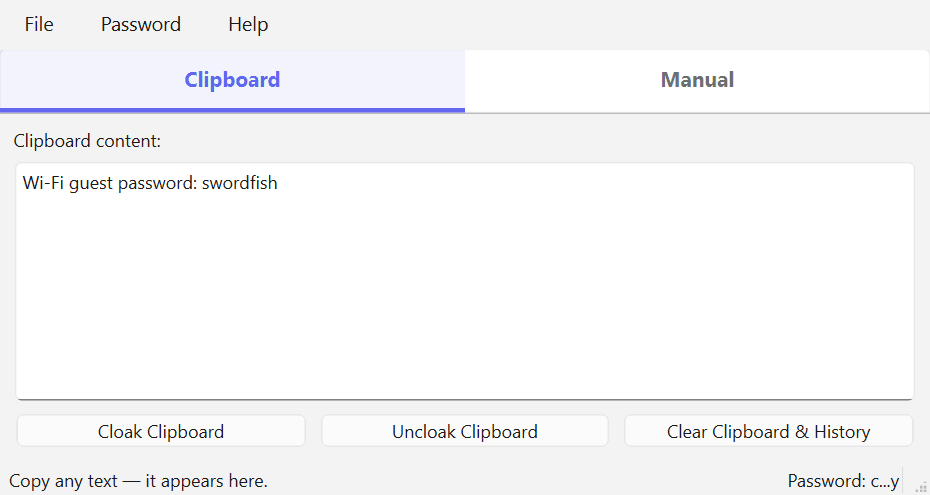
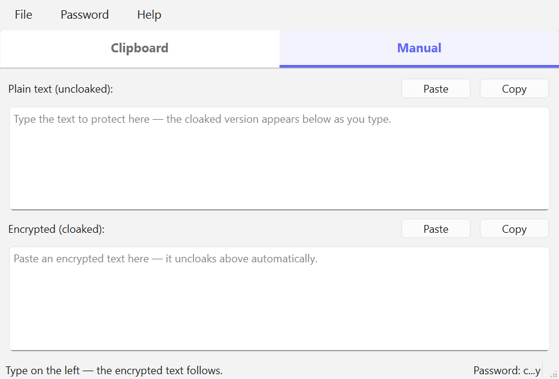

# CloakClip

Encrypt ("cloak") and decrypt ("uncloak") text with a shared password.

## Why cloak text

A cloaked message is just a line of ordinary characters, so it travels anywhere plain text goes — no attachments, no plugins, nothing for the other end to install. That makes it useful wherever a message will outlive the moment you send it: chats and DMs that your employer or the platform retains, emails that sit on servers and get forwarded and backed up, tickets and shared documents that more people can read than you intended. Sending a colleague a Wi-Fi password, an API key, or a licence key is the classic case.

It works just as well when there is no second party. "Cloaked" personal notes let you keep something sensitive inside a notes app that syncs to somebody else's cloud — recovery codes, account details, a private journal entry, the answer to a security question — where the note is readable by anyone with access to the account, but the cloaked block is not. The same trick covers anything you have to route through a channel you do not control, right down to leaving yourself a note in a place you would rather not trust.

**Share the password through a different channel than the message.** If you email a cloaked block, do not email the password — send it by text, say it in a phone call, or hand it over in person. Anything else puts both halves in the same place, and whoever can read that place has the plain text. The same goes for the obvious shortcut of putting the password in the next chat message: use a genuinely separate route. A password is also worth reusing only as long as it stays private between the two of you, and it should be long — see the note on key derivation under [Compatibility](#compatibility).

## Usage

The window has two tabs for two ways of working.

**Clipboard tab** — the one-click flow. The box shows whatever is on the clipboard. Copy text anywhere, click **Cloak Clipboard**, and the clipboard now holds the encrypted string — paste it anywhere. Copy an encrypted string and click **Uncloak Clipboard**, and the clipboard holds the original text, ready to paste (marked secret: kept out of Win+V history and cleared when you close the app).

The box is editable, so a cloaked message can be answered in place: uncloak it, change the wording, and the clipboard follows your edits as you type. Click **Cloak Clipboard** when you are done and paste the reply back into the conversation. Edits to uncloaked text stay marked secret, exactly as the uncloak was.



**Manual tab** — two fields that stay in sync, with no buttons to press for either direction. Type in **Plain text** and the **Encrypted** field below fills in as you type; paste an encrypted string into **Encrypted** and the plain text appears above. Each field has its own **Paste** and **Copy** buttons, and both accept normal editing (right-click menu, Ctrl+V, Ctrl+Z). Nothing touches the clipboard until you click a **Copy** button, so reading a message here means the secret never reaches the clipboard at all.



Two things about this tab are worth knowing. The conversion runs a moment after you stop typing rather than on every keystroke, so the encrypted field settles instead of flickering. And a string you *paste* into the encrypted field is left exactly as pasted — it is only regenerated if you then edit the plain text, at which point it changes completely (see the note on repeated cloaking below). While you are typing a cloaked string by hand, or if the active password is wrong, the plain field simply stays empty with a note in the status bar.

## The Password menu

Passwords live in the **Password** menu (or press **Ctrl+P** for a new one). The menu shows the last password used and up to ten recent ones, each displayed only as its first and last character (`h...!`) to jog your memory without revealing it. Picking an entry makes it the active password — shown masked in the status bar — and it stays active until you pick another. Acting without a password selected opens the password dialog on either tab, and the dialog offers a one-click **Use Last Password (h...!)** button when a history exists. On the Manual tab the dialog is offered once; dismissing it leaves a hint in the status bar rather than reappearing on every keystroke, and the fields sync as soon as you pick a password from the menu.

A password only enters the history after it *works* — a successful uncloak, or a cloaked result you actually copied — so typos and wrong guesses are never remembered.

The history is stored encrypted with Windows DPAPI in `%APPDATA%\CloakClip\passwordHistory.bin`, tied to your Windows account: unreadable from other accounts or machines, but decryptable by any program running as you. If you don't want passwords kept at all, use **Password > Clear Password History**.

## Theme

CloakClip follows the Windows light/dark setting by default. **Help > Theme** overrides it for this app alone — **Light**, **Dark**, or back to **Use System Theme** — and the choice is remembered in `%APPDATA%\CloakClip\settings.ini`. In system mode the app also follows along if you switch Windows between light and dark while it is running.

## Window position

CloakClip reopens at the size and position it had when you closed it, remembered in `%APPDATA%\CloakClip\settings.ini`. Delete that file to go back to the default size. If the window was last on a monitor that is no longer attached, it is recentred on the primary screen rather than restored off-screen.

A wrong password, or text that was not encrypted, shows a message in the status bar and changes nothing.

**Clear Clipboard & History** (on the Clipboard tab) empties the clipboard and purges Windows clipboard history (Win+V), which is the way to clean up plain text that *other* apps copied — for example the password you copied out of an email in order to cloak it. Items you pinned in Win+V are kept.

## How your secrets are protected

Windows keeps a history of everything copied (Win+V) and can sync it to the cloud, so a decrypted secret sitting on the clipboard normally outlives both the paste and the app. CloakClip avoids that three ways:

- **The Manual tab keeps secrets off the clipboard entirely.** Uncloaked text is only displayed; if you just need to read a message, it never leaves the window.
- **Any uncloaked text that does reach the clipboard is marked secret** (the Clipboard tab's Uncloak, and the Manual tab's plain-text Copy) using the same Windows clipboard formats password managers use, so Windows keeps it out of clipboard history and cloud sync. It still pastes normally.
- **Re-copying a secret by hand is caught.** If you copy an uncloaked text again yourself — selecting it on screen, or re-copying it after pasting — that ordinary copy has no secret marking, so Windows records it. CloakClip watches for its session secrets reappearing on the clipboard, re-protects them, and deletes the recorded entries from Win+V history.
- **Closing the app cleans up**: a copied secret is cleared from the clipboard, and any session secret that reached Win+V history is deleted from it. Cloaked text is left alone, since it is encrypted and you may still want to paste it.

The guard can only match exact text from the current session — a secret edited after pasting, or one uncloaked in a previous run, is not recognized. For those, use **Clear Clipboard & History**.

## Why cloaking the same text twice gives different results

Every cloak generates a fresh random initialization vector, so cloaking the same text with the same password produces a completely different string each time. All of them uncloak back to the original — use whichever one you copied. This is deliberate: without it, identical messages would produce identical strings, and anyone seeing two of them could tell they matched without knowing the password. The only practical consequence is that you cannot compare two cloaked strings to check whether they hold the same secret.

## Platform support

Windows is the fully supported platform. The app builds and runs on macOS, but the clipboard protections do not exist there yet: `services/platform/` holds a per-OS backend, and macOS currently gets the generic one, which reports every protection as unavailable rather than pretending. The password history is likewise Windows-only for now, since it is encrypted with DPAPI.

A macOS port means adding `services/platform/macClipboard.py` and a Keychain-backed password store — nothing above that layer changes. Be aware that macOS has no built-in clipboard history to purge (so that exposure does not exist), that the nearest equivalent to secret marking is the `org.nspasteboard.ConcealedType` convention which clipboard managers *choose* to honour, and that Universal Clipboard syncing is a new exposure with no Windows counterpart.

## Compatibility

The scheme is AES-256-CBC with the key derived as SHA-256 of the password, a random 16-byte IV prepended to the ciphertext, and the whole payload Base64-encoded. Any tool implementing the same scheme can read CloakClip's output and vice versa. Note that the key derivation is a single unsalted SHA-256 — no PBKDF2 or Argon2 stretching — so a short password is vulnerable to offline guessing. Use a long one.

## Standalone executable

Every push builds both platforms on GitHub Actions — grab `CloakClip.exe` or `CloakClip-macos.zip` from the run's **Artifacts**. Pushing a version tag (`v0.8.0`) also publishes a Release with both attached.

To build locally instead:

```powershell
.\.venv\Scripts\python.exe tools\buildStandalone.py
```

Or double-click **`buildStandalone.cmd`**. The result is **`dist\CloakClip.exe`** (about 50 MB, since Qt travels with it) — or `dist/CloakClip.app` on a Mac. Local and CI builds share `cloakClip.spec`, so they produce the same thing.

To check a build is complete — the bundled icon and the Windows clipboard-history bindings both fail *quietly* if packaging drops them — run:

```powershell
.\dist\CloakClip.exe --selftest report.txt
```

It exits 0 and writes a short report when everything is present.

The icon itself is generated, not hand-drawn; edit `tools/makeIcon.py` and re-run it to change the artwork:

```powershell
.\.venv\Scripts\python.exe tools\makeIcon.py
```

The demo GIFs above are recorded from the running app, so they cannot drift from the real UI. Re-record them after a UI change:

```powershell
.\.venv\Scripts\python.exe tools\makeDemoGifs.py
```

## One-time setup

```powershell
cd W:\projects\26cloakClip
python -m venv .venv
.\.venv\Scripts\Activate.ps1
pip install -e ".[dev,build]"
```

## Daily workflow

```powershell
cd W:\projects\26cloakClip
.\.venv\Scripts\Activate.ps1
cloak-clip
```

Or without the script entry point:

```powershell
python -m cloakClip.main
```

Or just double-click **`runApp.cmd`** in the project folder (needs the one-time setup done first).

## Tests and lint

```powershell
pytest
ruff check src tests
```

## Structure

| Layer | Folder | Purpose |
|-------|--------|---------|
| Entry | `src/cloakClip/main.py` | Start `QApplication`, show main window |
| Config | `src/cloakClip/appConfig.py` | Paths, defaults, app metadata |
| UI | `src/cloakClip/ui/` | Widgets and dialogs only |
| Services | `src/cloakClip/services/` | Business logic (no Qt widgets) |
| Models | `src/cloakClip/models/` | Plain Python data types |

See `AGENTS.md` for architecture and naming conventions (for you and AI agents).

---
*Created from the Qt App Template.*
